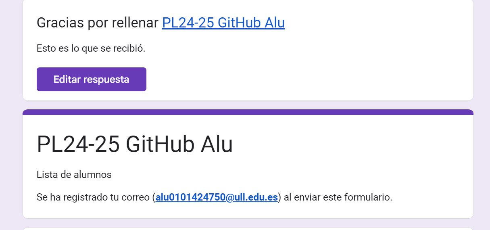
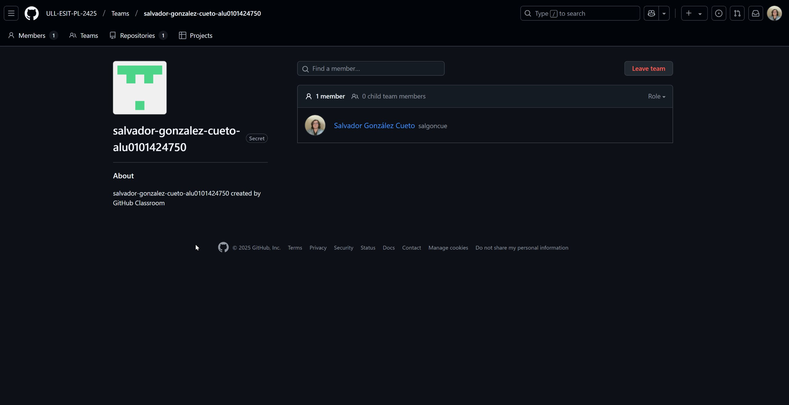
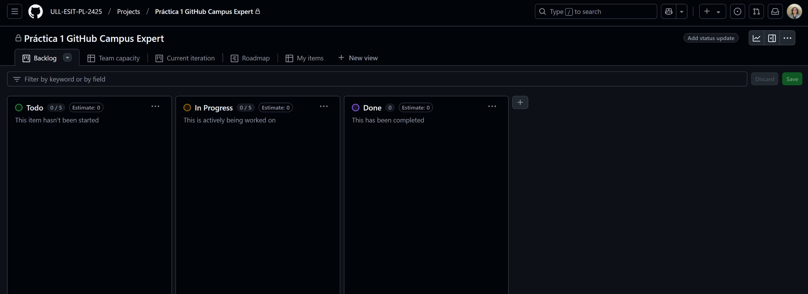
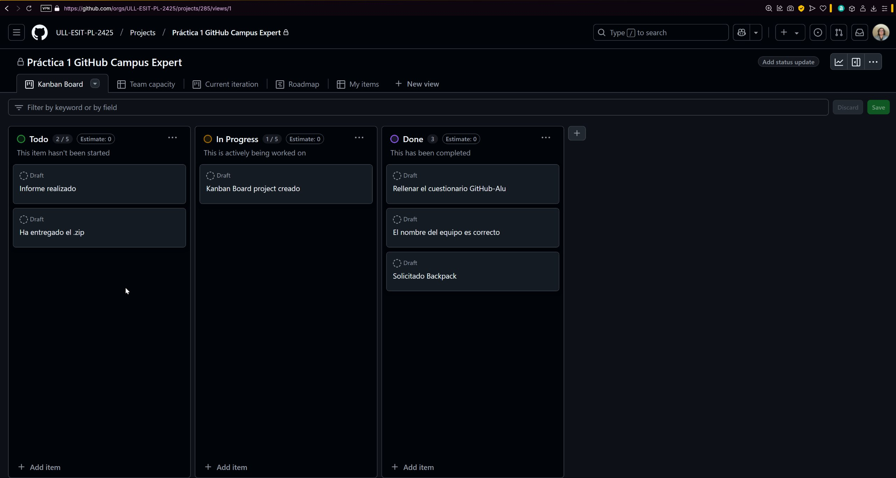
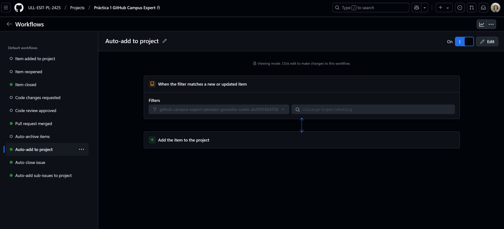
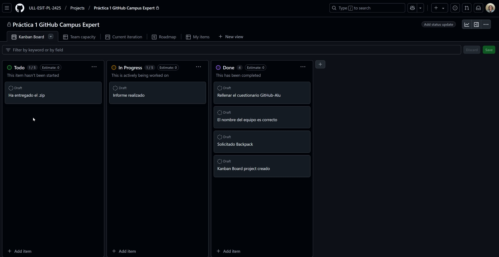
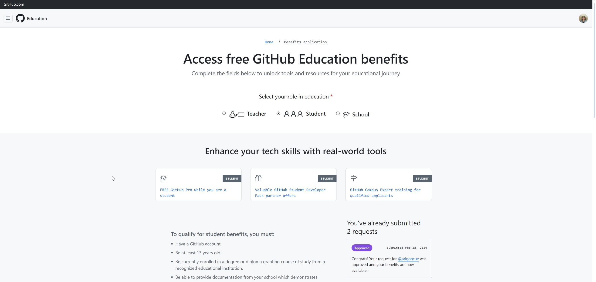

# Github Campus Expert 

- Salvador 
- González Cueto 
- alu0101424750

## Rellenar el cuestionario GitHub-Alu del campus virtual y recibir el correo confirmándolo

## Crear equipo con nombre correcto

## Crear un project board kanban para este repositorio

1. Crear el project board kanban

2. Una vez creado el project board:
   - Crear tantas actividades como tareas hayan en la rúbrica.
   - Asignar las tareas ya realizadas o en progreso a cada columna correspondiente.

3. Asociar el kanban al repositorio correspondiente de la práctica.

4. Una vez finalizado el kanban actualizar las columnas.

## Solicitar el GitHub Student Pack

